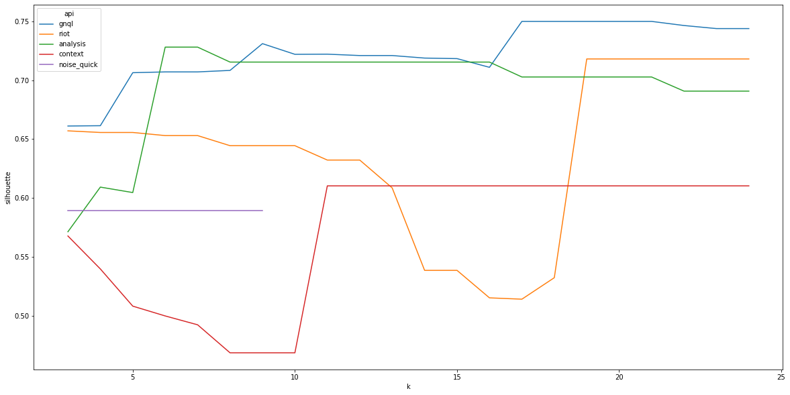
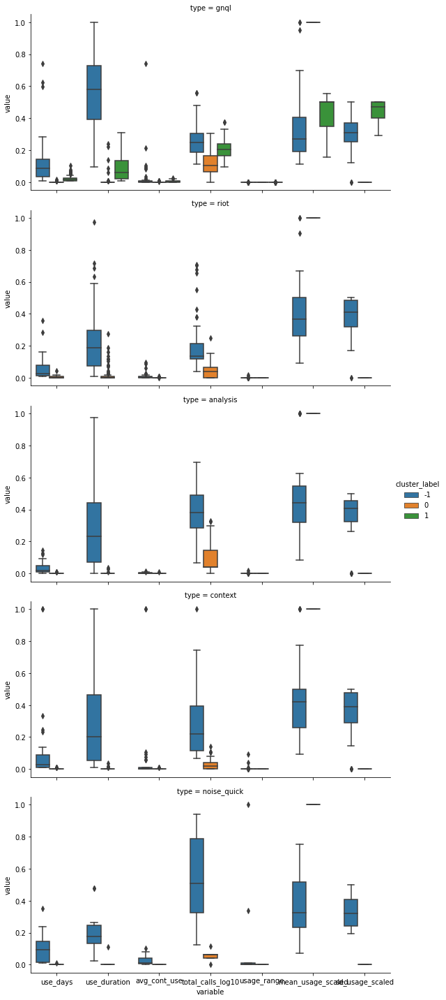

# GreyNoise DataSci User Grouping Case Study
This is an example project for Data Science at GreyNoise

## Description
For this project we'd like you to take our business intelligence data and try to identify users that have similar patterns of use so we can better serve their needs. Included is a csv of mock api usage for a set of users over a 16 week period. There are five different types of APIs included, which should be considered different use cases (for this exercise the definitions don't matter, just that they are different and different users would use different combinations at different ammunts).

See: `user_api_data.csv`

## Goal
Your challenge is to find groups within this set that seem to have similar usage patterns. There are a lot of ways to slice this problem, so part of the task is to think about what you can do to turn this into cohesive groups.

## Deliverable
1. Initial thinking and plan of action. *This is the most important part.*
2. A csv of relevant groups found with their corresponding api usage metrics.
3. Some code (jupyter notebook, python script, javascript, go, or R) to reproduce your results. Don't worry about packaging imports or cleaning up file system references.
4. Afterthoughts and where you could go with more time.

## What we don't expect from you:
- Perfection
- More than two hours of effort
    - Completion is not the only metric.
    - Initial thoughts, partial code, and describing what you did is most important.
    - A well thought out plan is more important than a final result.


# Deliverable / Write up
## Initial thinking and plan of action
### Approach for this notebook
The plan for clustering was as follows:  
* Read in the data and make any necessary data type conversions
* Convert the raw time series data into aggregate features by API type and user_id
* Scale features to standardize distance for clustering calculations
* Split data by API type 
* Loop through multiple DBSCAN min_sample values and collect model performances
* Identify the best model based on silhouette score
* Plot input data by cluster label and api type
* Join the best model's labels into the input (feature engineered) dataset and original dataset

### Libraries Used
The libraries used for this analysis were numpy, pandas, collections, sklearn, matplotlib, and seaborn. Numpy and pandas were used for general data reading, manipulation, and calculating aggregate statistics during feature engineering. The collections library's Counter function was used during feature engineering as a shortcut for calculating value counts. Sklean was used for modeling with DBSCAN as well as minmax scaling of dataframe columns. Matplotlib and seaborn were used to plot model quality metrics and final cluster characteristics. 

### Feature Engineering
The following features were constructed from the raw time series input data:  
**Duration Based Features**  
* Total days used (use_days)
* Total duration of any usage (use_duration)
* Average duration of continuous usage (avg_cont_use)

**Usage Volume Features - Scaled to Whole Population**  
* Log10 of the sum of API Calls (total_calls_log10)
* Mean scaled usage (mean_usage_scaled)

**Usage Volume Features - Scaled Within User**  
* SD scaled usage (sd_usage_scaled)
* Range of usage (usage_range)

The duration based features show consistency and longevity of usage with the intention of separating sporadic vs. consistent users. The mean and SD scaled usage features also show consistency by demonstrating how much a single user varies their usage within an API. The log transformed sum of calls is intended to separate low vs high volume users since this feature was scaled across the population instead of within a single id. Log transformation was used due to a few high volume outliers skewing most other users too close to 0. 

Min-max scaling was used on all features to make distances standard during DBSCAN calculations and make the epsilon choice more clear. Two features - mean and SD scaled usage - ran into issues with zero division for users who only had 1 observation or never changed their API usage (max == min). In these cases, a custom min max scaler was written to provide 1 as a default option since the goal of these metrics was to measure consistency of usage and these users were consistent, albeit briefly. Defaulting to 0 would also work depending on the situation. 

### Results
DBSCAN appears to have struggled to identify many discrete groups. The most unique cluster labels identified was 3 including 1 label for obervations out of clusters. Despite the low number of clusters, the number of non-noise cluster observations was typically around 50% which indicates that approximately half of the users have some shared feature that may be useful for business intelligence. PArticularly, the final graphs in this notebook show some differences between the total log number of api calls and usage duration among the groups. With more time hypothesis testing on the group differences could be performed to allow business intelligence to focus on statistically significant results.

## Thoughts for going forward
Although my initial approach of clustering the time series data directly did not work in this trial, I still believe this approach deserves further investigation. If more time was available, I would have attempted additional preprocessing techniques such as log scaling, connecting discontinued sequences, or possibly standardizing/removing sequence gaps. 

In this notebook's analysis, I would have liked to engineer some additional features such as the slope of a line fit to the time series data or the number of usage peaks that a user exhibits but I was unsure of the appropriateness of these features without further subject matter expertise. I was also not entirely pleased with the duration based usage features due to the limitations of the input data. For example, the "Total days used" feature may be inaccurate if a user's activity extended beyond the provided time frame. 
For modeling, additional clustering techniques such as KMeans should be tried and the parameter values should be chosen more systematically. DBSCAN was used to avoid specifying a number of clusters and the parameter selection loop could be [1] written more cleanly using sklearn's gridsearchcv and [2] be expanded to include a search for optimal epsilon (eps) value which was chosen here as a result of trial and error based on the scale of the input features. 


```python
# General Imports
import numpy as np
import pandas as pd
from collections import Counter
from sklearn.preprocessing import MinMaxScaler
from sklearn.metrics import silhouette_score

# Modeling
from sklearn.cluster import DBSCAN
# Plotting
import matplotlib.pyplot as plt
import seaborn as sns
# Avoiding scientific notation and formatting floats with two decimal points for ease of reading.
pd.set_option('display.float_format', lambda x: '%.2f' % x)

seed=1
np.random.seed(seed)
```


```python
data = pd.read_csv("./data/user_api_data.csv")
data["dt"] = pd.to_datetime(data["dt"])
data["user_id"] = data["user_id"].astype("object")
data.head()
```


<div>
<style scoped>
    .dataframe tbody tr th:only-of-type {
        vertical-align: middle;
    }

    .dataframe tbody tr th {
        vertical-align: top;
    }

    .dataframe thead th {
        text-align: right;
    }
</style>
<table border="1" class="dataframe">
  <thead>
    <tr style="text-align: right;">
      <th></th>
      <th>dt</th>
      <th>user_id</th>
      <th>type</th>
      <th>api_count</th>
    </tr>
  </thead>
  <tbody>
    <tr>
      <th>0</th>
      <td>2021-08-13</td>
      <td>0</td>
      <td>gnql</td>
      <td>144</td>
    </tr>
    <tr>
      <th>1</th>
      <td>2021-08-13</td>
      <td>1</td>
      <td>gnql</td>
      <td>2</td>
    </tr>
    <tr>
      <th>2</th>
      <td>2021-08-13</td>
      <td>1</td>
      <td>riot</td>
      <td>1</td>
    </tr>
    <tr>
      <th>3</th>
      <td>2021-08-13</td>
      <td>2</td>
      <td>analysis</td>
      <td>1</td>
    </tr>
    <tr>
      <th>4</th>
      <td>2021-08-13</td>
      <td>2</td>
      <td>gnql</td>
      <td>4</td>
    </tr>
  </tbody>
</table>
</div>


```python
def min_max_scale(x):
    """
    Basic min-max scaler with a default option to return 1 if min==max.
    """
    min_x = min(x)
    max_x = max(x)
    if min_x == max_x:
        return 1
    else: 
         return (x-min_x) / (max_x-min_x)
        
def avg_consecutive_dates(x):
    """
    Mean value of days in which an API was used continuously.
    """
    return np.mean(list(Counter(x.diff().dt.days.ne(1).cumsum().values).values()))

# Set up scaler to be used in the next cell
scaler = MinMaxScaler()
```


```python
# Feature Engineering
agg_data = data.groupby(['user_id', 'type']).agg(
    # Duration Statistics 
    use_days = ('api_count', len),
    use_duration = ('dt', lambda x: (max(x) - min(x)).days),
    avg_cont_use = ('dt', lambda x: avg_consecutive_dates(x)),
    
    # Overall Usage 
    total_calls_log10 = ('api_count', lambda x: np.log10(sum(x))),
    usage_range = ('api_count', lambda x: max(x)-min(x)),

    # Mean Usage - scaled within feature creation to provide a default value (1) in the event of zero division
    mean_usage_scaled = ('api_count', lambda x: np.mean(min_max_scale(x))),
    sd_usage_scaled = ('api_count', lambda x: np.nan_to_num(np.std(min_max_scale(x))))

).reset_index()

unscaled_features = ['use_days','use_duration','usage_range', 'avg_cont_use', 'total_calls_log10']
agg_data[unscaled_features] = scaler.fit_transform(agg_data[unscaled_features])

agg_data.head()
```


<div>
<style scoped>
    .dataframe tbody tr th:only-of-type {
        vertical-align: middle;
    }

    .dataframe tbody tr th {
        vertical-align: top;
    }

    .dataframe thead th {
        text-align: right;
    }
</style>
<table border="1" class="dataframe">
  <thead>
    <tr style="text-align: right;">
      <th></th>
      <th>user_id</th>
      <th>type</th>
      <th>use_days</th>
      <th>use_duration</th>
      <th>avg_cont_use</th>
      <th>total_calls_log10</th>
      <th>usage_range</th>
      <th>mean_usage_scaled</th>
      <th>sd_usage_scaled</th>
    </tr>
  </thead>
  <tbody>
    <tr>
      <th>0</th>
      <td>0</td>
      <td>gnql</td>
      <td>0.74</td>
      <td>0.74</td>
      <td>0.74</td>
      <td>0.56</td>
      <td>0.00</td>
      <td>0.95</td>
      <td>0.12</td>
    </tr>
    <tr>
      <th>1</th>
      <td>1</td>
      <td>gnql</td>
      <td>0.00</td>
      <td>0.00</td>
      <td>0.00</td>
      <td>0.04</td>
      <td>0.00</td>
      <td>1.00</td>
      <td>0.00</td>
    </tr>
    <tr>
      <th>2</th>
      <td>1</td>
      <td>riot</td>
      <td>0.00</td>
      <td>0.00</td>
      <td>0.00</td>
      <td>0.00</td>
      <td>0.00</td>
      <td>1.00</td>
      <td>0.00</td>
    </tr>
    <tr>
      <th>3</th>
      <td>2</td>
      <td>analysis</td>
      <td>0.00</td>
      <td>0.00</td>
      <td>0.00</td>
      <td>0.00</td>
      <td>0.00</td>
      <td>1.00</td>
      <td>0.00</td>
    </tr>
    <tr>
      <th>4</th>
      <td>2</td>
      <td>gnql</td>
      <td>0.03</td>
      <td>0.15</td>
      <td>0.00</td>
      <td>0.22</td>
      <td>0.00</td>
      <td>0.28</td>
      <td>0.42</td>
    </tr>
  </tbody>
</table>
</div>


## Modeling


```python
model_metrics = []
best_models = []
agg_data_withLabels = []

for api in data.type.unique():
    # Subset to a single API
    api_data = agg_data[agg_data.type == api].copy()
    
    # Drop non input feature data
    x = api_data.drop(['user_id', 'type'], axis=1)

    # Create vectors to track the current API's best model and metrics
    api_model_metrics = []
    api_best_silhouette = -1

    # Loop through different values of min_samples
    for k in range(3, 25):
        model = DBSCAN(eps=.15, min_samples=k).fit(x)
        labels = model.labels_
        
        # Only proceed if the model was able to cluster (all -1 == all noise)
        if any(labels != -1):
            sil = silhouette_score(x, labels)
            api_model_metrics.append({'k':k, 'noise':list(labels).count(-1), 'silhouette':sil})
            
            model_metrics.append({'api':api, 'k':k, 'noise':list(labels).count(-1), 'silhouette':sil})

            # If model has improved, save it
            if sil > api_best_silhouette:
                api_best_model = model
                api_best_labels = labels
                api_best_k = k
                api_data['cluster_label'] = labels
        else:
            pass
    
    # Save the current API's best model to the global list with all other APIs
    best_models.append({'api':api, 'model':api_best_model, 'labels':api_best_labels})
    agg_data_withLabels.append(api_data)
    
    
# Convert model metrics list to dataframe
model_metrics_df = pd.DataFrame(model_metrics)

# Convert list of dataframes to single dataframe
agg_data_withLabels = pd.concat(agg_data_withLabels) 

## Joining Labels Data Back into Input Data
data_withLabels = pd.merge(data, agg_data_withLabels[['user_id', 'type', 'cluster_label']], how="left", on=['user_id', 'type'])
```


```python
# Plotting silhouette scores
plt.figure(figsize=(20,10))
sns.lineplot(x='k', y='silhouette', hue='api', data=model_metrics_df)
plt.show()
```


    

    


## Description of Identified Clusters


```python
group_cols = ['type', 'cluster_label']
stat_cols = ['use_days', 'use_duration', 'avg_cont_use', 'total_calls_log10', 
             'usage_range', 'mean_usage_scaled', 'sd_usage_scaled']

# Convert data to long form
agg_data_long = agg_data_withLabels.drop('user_id', axis=1).melt(id_vars = group_cols)

print(agg_data_withLabels.groupby(['type']).cluster_label.value_counts())
# Plot each category by cluster and API type
sns.catplot(
    x='variable', y='value', 
    hue='cluster_label', row='type', 
    kind='box', height = 4, aspect = 2,
    data=agg_data_long)
plt.show()
```

    type         cluster_label
    analysis      0                71
                 -1                35
    context       0                46
                 -1                44
    gnql          0               331
                  1               146
                 -1                77
    noise_quick  -1                12
                  0                 9
    riot          0                74
                 -1                67
    Name: cluster_label, dtype: int64


    

    


## Writing Output


```python
# Aggregated Input Features with Cluster Labels
agg_data_withLabels.to_csv('ip_cluster_labeled_input_features.csv')

# Raw Data  with Cluster Labels
data_withLabels.to_csv('ip_cluster_labeled_raw_data.csv')
```


```python
!jupyter nbconvert --execute --to markdown README.ipynb
```

    [NbConvertApp] WARNING | pattern 'README.ipynb' matched no files
    This application is used to convert notebook files (*.ipynb)
            to various other formats.
    
            WARNING: THE COMMANDLINE INTERFACE MAY CHANGE IN FUTURE RELEASES.
    
    Options
    =======
    The options below are convenience aliases to configurable class-options,
    as listed in the "Equivalent to" description-line of the aliases.
    To see all configurable class-options for some <cmd>, use:
        <cmd> --help-all
    
    --debug
        set log level to logging.DEBUG (maximize logging output)
        Equivalent to: [--Application.log_level=10]
    --show-config
        Show the application's configuration (human-readable format)
        Equivalent to: [--Application.show_config=True]
    --show-config-json
        Show the application's configuration (json format)
        Equivalent to: [--Application.show_config_json=True]
    --generate-config
        generate default config file
        Equivalent to: [--JupyterApp.generate_config=True]
    -y
        Answer yes to any questions instead of prompting.
        Equivalent to: [--JupyterApp.answer_yes=True]
    --execute
        Execute the notebook prior to export.
        Equivalent to: [--ExecutePreprocessor.enabled=True]
    --allow-errors
        Continue notebook execution even if one of the cells throws an error and include the error message in the cell output (the default behaviour is to abort conversion). This flag is only relevant if '--execute' was specified, too.
        Equivalent to: [--ExecutePreprocessor.allow_errors=True]
    --stdin
        read a single notebook file from stdin. Write the resulting notebook with default basename 'notebook.*'
        Equivalent to: [--NbConvertApp.from_stdin=True]
    --stdout
        Write notebook output to stdout instead of files.
        Equivalent to: [--NbConvertApp.writer_class=StdoutWriter]
    --inplace
        Run nbconvert in place, overwriting the existing notebook (only 
                relevant when converting to notebook format)
        Equivalent to: [--NbConvertApp.use_output_suffix=False --NbConvertApp.export_format=notebook --FilesWriter.build_directory=]
    --clear-output
        Clear output of current file and save in place, 
                overwriting the existing notebook.
        Equivalent to: [--NbConvertApp.use_output_suffix=False --NbConvertApp.export_format=notebook --FilesWriter.build_directory= --ClearOutputPreprocessor.enabled=True]
    --no-prompt
        Exclude input and output prompts from converted document.
        Equivalent to: [--TemplateExporter.exclude_input_prompt=True --TemplateExporter.exclude_output_prompt=True]
    --no-input
        Exclude input cells and output prompts from converted document. 
                This mode is ideal for generating code-free reports.
        Equivalent to: [--TemplateExporter.exclude_output_prompt=True --TemplateExporter.exclude_input=True --TemplateExporter.exclude_input_prompt=True]
    --allow-chromium-download
        Whether to allow downloading chromium if no suitable version is found on the system.
        Equivalent to: [--WebPDFExporter.allow_chromium_download=True]
    --disable-chromium-sandbox
        Disable chromium security sandbox when converting to PDF..
        Equivalent to: [--WebPDFExporter.disable_sandbox=True]
    --show-input
        Shows code input. This flag is only useful for dejavu users.
        Equivalent to: [--TemplateExporter.exclude_input=False]
    --embed-images
        Embed the images as base64 dataurls in the output. This flag is only useful for the HTML/WebPDF/Slides exports.
        Equivalent to: [--HTMLExporter.embed_images=True]
    --log-level=<Enum>
        Set the log level by value or name.
        Choices: any of [0, 10, 20, 30, 40, 50, 'DEBUG', 'INFO', 'WARN', 'ERROR', 'CRITICAL']
        Default: 30
        Equivalent to: [--Application.log_level]
    --config=<Unicode>
        Full path of a config file.
        Default: ''
        Equivalent to: [--JupyterApp.config_file]
    --to=<Unicode>
        The export format to be used, either one of the built-in formats
                ['asciidoc', 'custom', 'html', 'latex', 'markdown', 'notebook', 'pdf', 'python', 'rst', 'script', 'slides', 'webpdf']
                or a dotted object name that represents the import path for an
                ``Exporter`` class
        Default: ''
        Equivalent to: [--NbConvertApp.export_format]
    --template=<Unicode>
        Name of the template to use
        Default: ''
        Equivalent to: [--TemplateExporter.template_name]
    --template-file=<Unicode>
        Name of the template file to use
        Default: None
        Equivalent to: [--TemplateExporter.template_file]
    --theme=<Unicode>
        Template specific theme(e.g. the name of a JupyterLab CSS theme distributed
        as prebuilt extension for the lab template)
        Default: 'light'
        Equivalent to: [--HTMLExporter.theme]
    --writer=<DottedObjectName>
        Writer class used to write the 
                                            results of the conversion
        Default: 'FilesWriter'
        Equivalent to: [--NbConvertApp.writer_class]
    --post=<DottedOrNone>
        PostProcessor class used to write the
                                            results of the conversion
        Default: ''
        Equivalent to: [--NbConvertApp.postprocessor_class]
    --output=<Unicode>
        overwrite base name use for output files.
                    can only be used when converting one notebook at a time.
        Default: ''
        Equivalent to: [--NbConvertApp.output_base]
    --output-dir=<Unicode>
        Directory to write output(s) to. Defaults
                                      to output to the directory of each notebook. To recover
                                      previous default behaviour (outputting to the current 
                                      working directory) use . as the flag value.
        Default: ''
        Equivalent to: [--FilesWriter.build_directory]
    --reveal-prefix=<Unicode>
        The URL prefix for reveal.js (version 3.x).
                This defaults to the reveal CDN, but can be any url pointing to a copy 
                of reveal.js. 
                For speaker notes to work, this must be a relative path to a local 
                copy of reveal.js: e.g., "reveal.js".
                If a relative path is given, it must be a subdirectory of the
                current directory (from which the server is run).
                See the usage documentation
                (https://nbconvert.readthedocs.io/en/latest/usage.html#reveal-js-html-slideshow)
                for more details.
        Default: ''
        Equivalent to: [--SlidesExporter.reveal_url_prefix]
    --nbformat=<Enum>
        The nbformat version to write.
                Use this to downgrade notebooks.
        Choices: any of [1, 2, 3, 4]
        Default: 4
        Equivalent to: [--NotebookExporter.nbformat_version]
    
    Examples
    --------
    
        The simplest way to use nbconvert is
    
                > jupyter nbconvert mynotebook.ipynb --to html
    
                Options include ['asciidoc', 'custom', 'html', 'latex', 'markdown', 'notebook', 'pdf', 'python', 'rst', 'script', 'slides', 'webpdf'].
    
                > jupyter nbconvert --to latex mynotebook.ipynb
    
                Both HTML and LaTeX support multiple output templates. LaTeX includes
                'base', 'article' and 'report'.  HTML includes 'basic', 'lab' and 
                'classic'. You can specify the flavor of the format used.
    
                > jupyter nbconvert --to html --template lab mynotebook.ipynb
    
                You can also pipe the output to stdout, rather than a file
    
                > jupyter nbconvert mynotebook.ipynb --stdout
    
                PDF is generated via latex
    
                > jupyter nbconvert mynotebook.ipynb --to pdf
    
                You can get (and serve) a Reveal.js-powered slideshow
    
                > jupyter nbconvert myslides.ipynb --to slides --post serve
    
                Multiple notebooks can be given at the command line in a couple of 
                different ways:
    
                > jupyter nbconvert notebook*.ipynb
                > jupyter nbconvert notebook1.ipynb notebook2.ipynb
    
                or you can specify the notebooks list in a config file, containing::
    
                    c.NbConvertApp.notebooks = ["my_notebook.ipynb"]
    
                > jupyter nbconvert --config mycfg.py
    
    To see all available configurables, use `--help-all`.
    

